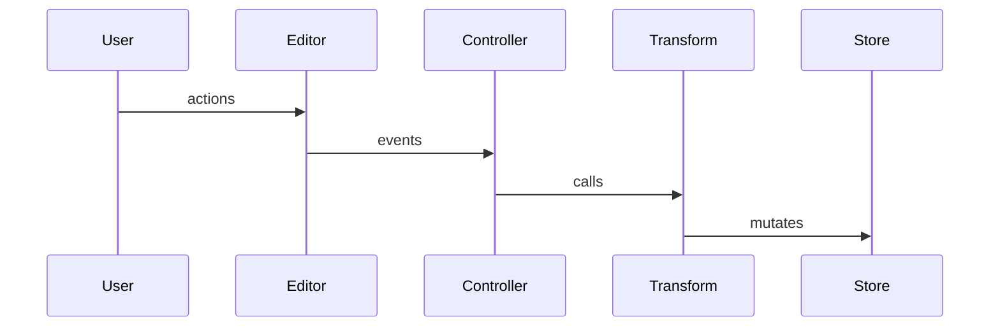
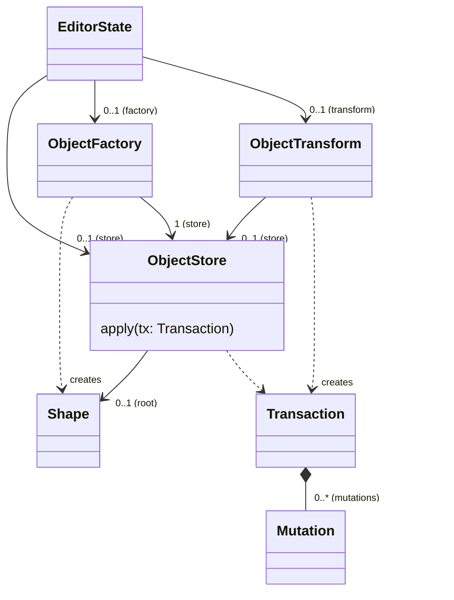
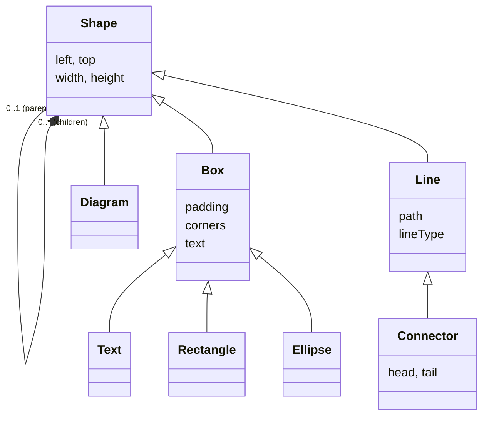

# dgmjs2

## Simplify routing

### Oblique routing

__Outline link인 경우__

1. end points들을 head/tail의 각 중점으로 이동.
3. end point들을 outline의 접점으로 이동.
2. reduce path (각도로 점제거)

__Connection Point link인 경우__

1. end points들을 head/tail의 각 connection point로 이동.
2. reduce path (각도로 점제거)

### Rectilinear routing

__Outline link인 경우__

1. end segment가 head/tail의 outline에 접접이 없을 경우, center point(cp)를 추가하고, end point를 cp의 x 또는 y로 직각이 되도록 연장한다.
2. head/tail 의 outline 내부에 있는 segment들을 끝에서 부터 제거.
3. 끝점의 segment를 outline의 접접으로 이동.
4. reduce path

__Connection Point link인 경우__

1. end point를 각 connection point에 추가.
2. 끝점의 segment가 일정 크기 이하인 경우, end point를 제거한 후의 끝점을 connection point로 이동한다.
3. reduce path

## TODO

- [ ] mouse event를 모두 pointer event로 변경

## Why dgmjs2?

- __Simplify__ - Eliminate unnecesary meta-model management (use simple `toJSON`/`fromJSON`)
- __Clear Mutations__ - All mutations should be done via actions (specifically constraint resolutions)
- __Realtime Collaboration__ - Allow integration with CRDT for realtime collaborations

## Editor's control flow

## Editor State

## Primitive Shapes

