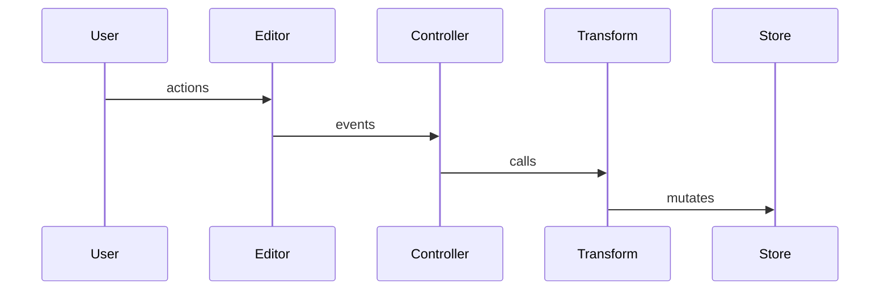
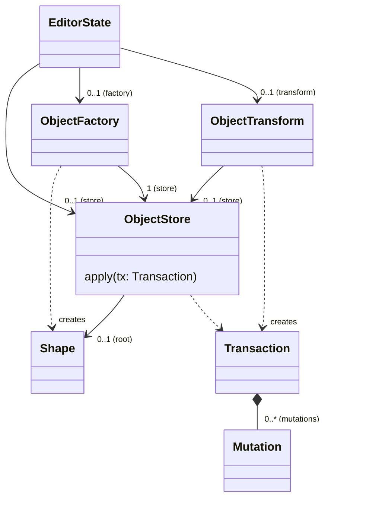
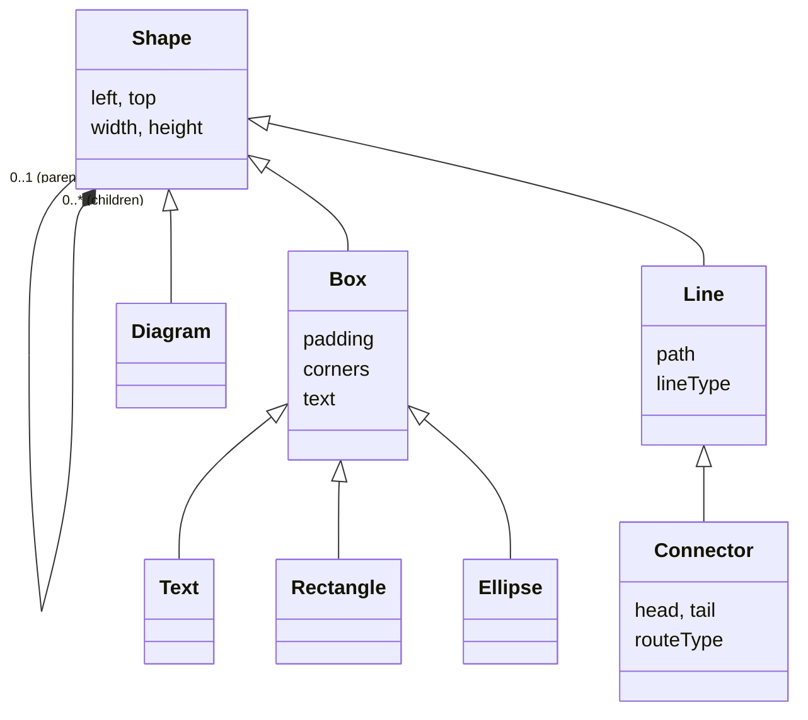

# dgmjs2

## Simplify routing

### Oblique routing

__Outline link인 경우__

1. end points들을 head/tail의 각 중점으로 이동.
3. end point들을 outline의 접점으로 이동.
2. reduce path (각도로 점제거)

__Connection Point link인 경우__

1. end points들을 head/tail의 각 connection point로 이동.
2. reduce path (각도로 점제거)

### Rectilinear routing

__Outline link인 경우__

1. end segment가 head/tail의 outline에 접접이 없을 경우, center point(cp)를 추가하고, end point를 cp의 x 또는 y로 직각이 되도록 연장한다.
2. head/tail 의 outline 내부에 있는 segment들을 끝에서 부터 제거.
3. 끝점의 segment를 outline의 접접으로 이동.
4. reduce path

__Connection Point link인 경우__

1. end point를 각 connection point에 추가.
2. 끝점의 segment가 일정 크기 이하인 경우, end point를 제거한 후의 끝점을 connection point로 이동한다.
3. reduce path

## TODO

- [ ] mouse event를 모두 pointer event로 변경

## Why dgmjs2?

- __Simplify__ - Eliminate unnecesary meta-model management (use simple `toJSON`/`fromJSON`)
- __Clear Mutations__ - All mutations should be done via actions (specifically constraint resolutions)
- __Realtime Collaboration__ - Allow integration with CRDT for realtime collaborations

## Editor's control flow



## Refactoring Transform

```js
class Mutation {
  isSeparator: boolean;
}
class InsertMutation extends Mutation {}
class DeleteMutation extends Mutation {}
class InsertToArrayMutation extends Mutation {}
class RemoveFromArrayMutation extends Mutation {}

export class Transform {
  store: ShapeStore;
  tx: Transaction | null;

  undoHistory: Stack[Mutation];
  redoHistory: Stack[Mutation];

  applyMutation(mutation: Mutation);

  startTransaction() {
    this.tx = new Transaction()
  }
  endTransaction() {
    if (!this.tx) throw new Error('No transaction started');
    undoHistory.push(this.tx);
    this.tx = null;
  }

  // basic mutations
  insert(shape);
  delete(shape);
  assign(shape, field, value) {
    if (!this.tx) throw new Error('No transaction started')
    // ...
  }
  insertToArray(shape, field, item);
  removeFromArray(shape, field, item);
  moveInArray(shape, field, fromIndex, toIndex);
}

class Controller {

  initialize(editor: Editor, shape: Shape) {
    const tr = editor.state.transform;
    tr.startTransaction();
  }

  update(editor: Editor, shape: Shape) {
    const tr = editor.state.transform;
    const dx = ...
    const dy = ...
    tr.assign(shape, 'left', shape.left + dx)
    tr.assign(shape, 'top', shape.top + dy)
  }

  finalize(editor: Editor, shape: Shape) {
    const tr = editor.state.transform;
    tr.endTransaction();
  }
}

class Constraint {
  validate(json: any) {
    z.validate(json)
    ...
  }
  resolve(editor: Editor, shape: Shape) {
    const tr = editor.state.transform;
    if (...) {
      tr.assign(shape, 'left', ...);
      tr.assign(shape, 'top', ...);
    }
  }
}

```

## Editor State



## Primitive Shapes


